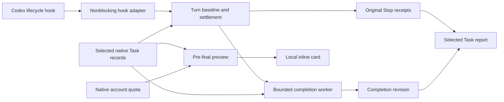

# Architecture

The external reporting seams are lifecycle JSON through the hook adapter,
`build_task_report(...)` for one selected Task, and `preview(...)` for one
running turn. CLI and hooks adapt their inputs to these interfaces. The optional
`exec-activity` CLI and prompt-time notices use a separate project-scoped
observation path; the signed updater and package/trust checker are independent
of report settlement. See the [documentation index](README.md).

## Included

- `auto_report`: bounded native observations, baselines, safe deltas, settlement.
- `auto_preview`: output-root validation and immutable pre-final cards.
- `reconcile`: one detached Python worker per reported Stop, bounded completion checks, and separate receipt revisions.
- `task_report`: current parent counter plus this plugin's recorded turn history.
- `task_catalog` / `child_usage`: native identity, selected lineage, attribution.
- `transcript`: native counter parsing.
- `report_i18n` / templates: deterministic localization and escaped rendering.
- `turn_quota` / `meter_source` / `meter_plan` / `quota_view`: native quota observation and presentation.
- `bootstrap`: SHA-256-pinned, cache-independent runtime loading.
- `exec_activity` / `exec_activity_cli`: bounded project catalog reads and
  private launcher lifecycle receipts. Launcher usage never enters parent totals.
- `update_notice` / `update_cli`: installed package and native hook-trust
  read-back, with nonblocking prompt-time notices.
- Publisher bootstrap and signed runtime: verified updates, per-Task pins,
  rollback, and separate active-runtime status.

Counter snapshots track native request records and legacy token-count events
separately. A matching, validated native request provides both Task and turn
totals even when the legacy event stream has a different historical baseline.
Only observations within a source establish resets; boundary differences never
cross sources. Invalid native records cannot silently fall back to an older
valid observation. See [metrics](METRICS.md) for status semantics.

## Completion reconciliation

`Stop` can arrive before the final native usage record is written. The initial
receipt therefore describes what was observable at Stop; it does not prove that
all final-answer usage was persisted. After a reported Stop, the hook schedules
at most one detached, report-only Python worker for that turn. The worker never
calls a model, sends a follow-up message, or continues the Task.

The worker makes at most eight bounded native-record scans with a 25-second
retry deadline. It requires the selected Task and turn's explicit `task_complete`
boundary before publishing a revision. Parsing stops at that boundary so a later
turn's counters and settings cannot be substituted. The child attribution window
remains the original turn-start-to-Stop window even if the check runs later.
Counter resets, truncated scans, missing observations, and incomplete child
coverage continue to produce partial or unavailable values.

A verified completion produces revision 2 as separate
`<hashed-turn-key>.reconciled.json`, `.reconciled.html`, and `.reconciled.md`
files. Original Stop JSON, HTML, and Markdown receipts remain immutable; their
files and links are not rewritten during reconciliation. After publication, the
Task index selects the revised receipt for fresh selected-Task report queries.
This also leaves any user edits to the original files untouched. `revision`,
`reconciliation_status`, and `reconciled_at` identify the later observation in
report data.

If completion is still unavailable when retries expire, the original provisional
receipt remains. The worker does not keep polling indefinitely. Disabling
automatic reports prevents new workers and causes running workers to stop at
their next settings check. Worker failures remain nonblocking. Persistent job
state stores hashed identities and status; native selectors travel to the worker
over its standard input and are not persisted in job state.

### Inline previews remain snapshots

Reconciliation updates saved receipts, not the already displayed pre-final
visualization. In a phone remote A/B experiment, a card initially displayed
synthetic version A / 100. The same HTML path was overwritten with B / 250.
After leaving and re-entering the Task, the original card still displayed A; a
new visualization reference displayed B. This establishes file readability for
a new reference, but not automatic refresh of an existing card. It does not
establish universal behavior across Codex clients or versions.

The plugin therefore keeps preview files immutable and does not depend on
same-path overwrites, a presumed cache timeout, or a background network request
inside the inline fragment. To inspect later usage, request a fresh Task report
or open the revised saved receipt. Host rendering and hook delivery remain
separate compatibility concerns.

## Extraction decisions

The reporting package has no import of the budget governor, budget ledger,
budget policy, cross-task workflow audit, or original project. Report state lives
in a separate directory. A failed reporting hook returns without denying user
work.

Selected-Task history is bounded to receipts this installation recorded.
`history_complete=false` is deliberate: a current native counter and a set of
recent receipts cannot prove complete lifetime coverage.

The zipapp is built deterministically from the included source and localization
assets. Updating source requires rebuilding and signing the publisher archive. The fixed
hook definitions remain unchanged for compatible runtime releases; see
[signed updates](SIGNED_UPDATES.md). Legacy digest-pinned Tasks retain their old archive.
