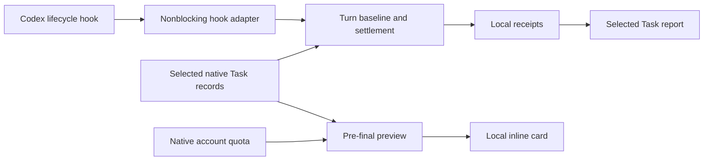

# Architecture

The external reporting seams are lifecycle JSON through the hook adapter,
`build_task_report(...)` for one selected Task, and `preview(...)` for one
running turn. CLI and hooks adapt their inputs to these interfaces.

## Included

- `auto_report`: bounded native observations, baselines, safe deltas, settlement.
- `auto_preview`: output-root validation and immutable pre-final cards.
- `task_report`: current parent counter plus this plugin's recorded turn history.
- `task_catalog` / `child_usage`: native identity, selected lineage, attribution.
- `transcript`: native counter parsing.
- `report_i18n` / templates: deterministic localization and escaped rendering.
- `turn_quota` / `meter_source` / `meter_plan` / `quota_view`: native quota observation and presentation.
- `bootstrap`: SHA-256-pinned, cache-independent runtime loading.

## Extraction decisions

The reporting package has no import of the budget governor, budget ledger,
budget policy, cross-task workflow audit, or original project. Report state lives
in a separate directory. A failed reporting hook returns without denying user
work.

Selected-Task history is bounded to receipts this installation recorded.
`history_complete=false` is deliberate: a current native counter and a set of
recent receipts cannot prove complete lifetime coverage.

The zipapp is built deterministically from the included source and localization
assets. Updating source requires rebuilding the archive and pinned hook commands.
