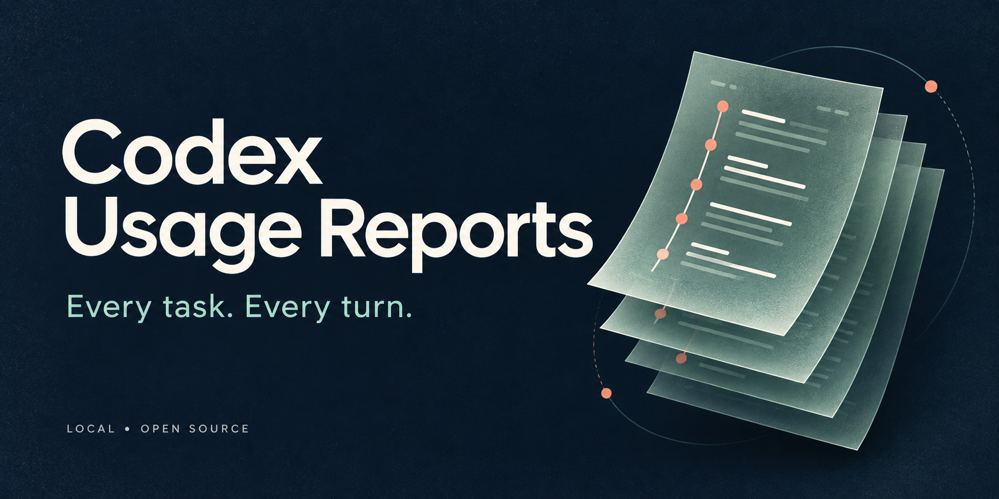
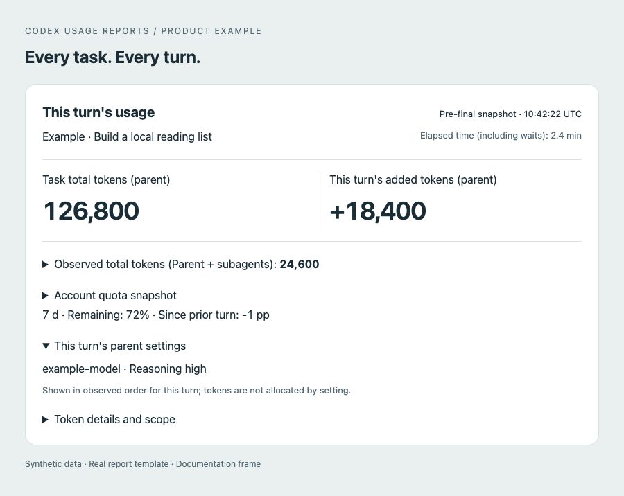
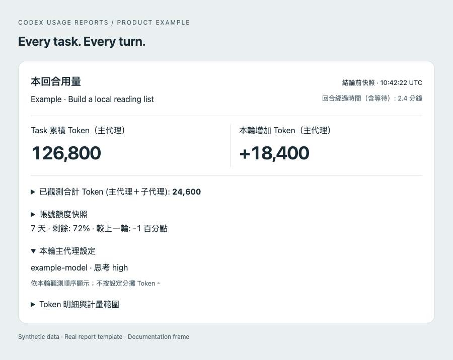

<p align="center">
  
</p>

# Codex Usage Reports

**自動產生每個 Codex Task 與每一輪的 Token 用量報告。** 在精簡的本機報告中查看 Task 累計用量、單輪增量、實際觀測到的模型、推理強度與子代理用量。

[](https://github.com/easyvibecoding/codex-usage-reports/actions/workflows/ci.yml)
[](../../LICENSE)
[](../../pyproject.toml)

[English](../../README.md) · **繁體中文** · [简体中文](README.zh-CN.md) · [日本語](README.ja.md)

[快速開始](#快速開始) · [報告範例](#看看報告) · [使用教學](../../docs/USAGE.md) · [數字如何計算](../../docs/METRICS.md) · [疑難排解](../../docs/TROUBLESHOOTING.md)

## 看清楚每一輪用了多少

一個長時間執行的 Task 可能包含多輪對話、模型切換與子代理。單一工作階段的總量無法說明最近一輪的變化。Codex Usage Reports 分別呈現這些範圍：

| 想知道什麼？ | 報告會顯示什麼？ |
| --- | --- |
| 這個 Task 累計用了多少？ | 所選父 Task 實際觀測到的累計 Token 用量。 |
| 這一輪增加了多少？ | 有效原生計數器觀測值之間的差額。 |
| 用了哪個模型與推理強度？ | 該輪觀測到的設定，包含可見的設定變更。 |
| 子代理用了多少？ | 獨立的子代理用量小計，以及資料涵蓋狀態。 |
| 帳號還剩多少配額？ | 若有可用資料，顯示原生配額觀測值，並與 Task Token 用量分開呈現。 |
| 之後還能查閱嗎？ | 留存於本機的 HTML、Markdown 與 JSON 報告紀錄。 |

執行階段僅使用 Python 標準函式庫，不需呼叫 LLM 計算用量、不需 API 金鑰，也不會將報告傳送至託管的分析服務。本專案從 [Codex Run Budget](https://github.com/easyvibecoding/codex-run-budget) 抽出報告功能，獨立運作。

## 看看報告



*此範例使用合成資料，由實際報告範本產生，並放在獨立的文件展示框中。桌面版會套用自己的外圍主題。*

<details>
<summary>繁體中文範例</summary>



</details>

[開啟範例集](../../docs/examples/README.md)，下載 HTML、查看完成後的報告紀錄與指定 Task 報告。品牌插畫使用 Codex 生圖製作；用量截圖則由合成測試資料實際渲染。[美術提示詞](../../docs/assets/PROMPTS.md)。

## 快速開始

需要 Python 3.10+，以及支援外掛 hooks 的本機 Codex 環境。行內卡片需要支援本機視覺化的桌面介面；CLI 使用者可閱讀已儲存的報告。原生資料結構會隨版本不同而變動，請參閱[相容性與驗證](../../docs/VALIDATION.md)。

### 1. 安裝外掛

```sh
codex plugin marketplace add easyvibecoding/codex-usage-reports
codex plugin add codex-usage-reports@codex-usage-reports
```

在 Codex 中檢視並信任外掛 hooks，然後**開啟新的 Task**。已安裝的 hooks 會依執行環境的信任與生命週期規則載入。請參閱官方[外掛指南](https://learn.chatgpt.com/docs/plugins)與 [hooks 指南](https://learn.chatgpt.com/docs/hooks)。

### 2. 照常工作

像平常一樣請 Codex 處理工作。Hook 會記錄該輪的基準值，要求在最終回答前產生一次卡片，並在收到支援的結束事件時儲存完成後的報告紀錄。自動報告預設啟用。

行內卡片是最終回答**之前**擷取的快照；完成後的報告紀錄可能包含後續用量。若執行環境略過某個 hook，或尚未提供計數器，報告會將資料標記為待更新、部分可用或無法取得。

### 3. 查看 Task

使用隨附的 `usage-report` skill，例如：

> 顯示這個 Task 的用量報告，包含每輪用量與實際觀測到的設定。

也可以複製儲存庫，使用獨立 CLI：

```sh
git clone https://github.com/easyvibecoding/codex-usage-reports.git
cd codex-usage-reports
python3 plugins/codex-usage-reports/scripts/usage_reports.py auto-report status
python3 plugins/codex-usage-reports/scripts/usage_reports.py task "$TASK_ID" --format markdown
```

將 `TASK_ID` 設為要查看的 Task 原生 ID。報告範圍僅限於該 Task。HTML 匯出、設定與解除安裝方式，請參閱[完整使用教學](../../docs/USAGE.md)。

## 可以查核的報告

- **如實呈現缺漏資料。** 計數器重設、截斷紀錄與設定衝突，都會保留為部分可用或未知。
- **保留歷史設定。** 目前的全域模型偏好不會覆蓋過去某輪的觀測結果。
- **區分統計範圍。** 快取輸入屬於輸入用量的一部分；推理輸出屬於輸出用量的一部分。子代理用量與帳號配額各自呈現。
- **資料留在本機。** 報告狀態中的原生識別碼會經過雜湊處理；私人顯示名稱可能出現在你的本機報告中。
- **輕量 hooks。** 報告出錯不會拒絕工具呼叫或停止代理。
- **多語系卡片。** 支援英文、繁體中文、簡體中文、日文、韓文、德文、法文、西班牙文與葡萄牙文；README 提供四種語言版本。

## 從 Codex Run Budget 移轉

兩個外掛各自獨立。如果保留原外掛的預算控制功能，請先停用原外掛的自動報告，再啟用本外掛，以免出現重複卡片。不需要遷移歷史資料庫。[移轉說明](../../docs/MIGRATION.md)。

## 限制

這些報告記錄實際觀測到的用量，**不等同帳單或精確費用**。配額屬於帳號，無法單靠 Token 總量分攤到個別 Task。子代理用量的歸屬取決於可取得的原生父子關係資料。Hook 是否送達與原生資料結構都可能隨 Codex 版本而變動。本外掛不設預算限制，也不會中斷工作。

報告可能透露專案名稱與使用模式。請將真實報告保留在本機；公開 issue 僅使用合成測試資料。[隱私與安全](../../SECURITY.md)。

## 參與貢獻

請參閱 [CONTRIBUTING.md](../../CONTRIBUTING.md)、[架構](../../docs/ARCHITECTURE.md)與[驗證方式](../../docs/VALIDATION.md)。歡迎提供精簡且可重現的錯誤回報，以及原生資料結構的相容性修正。請勿附上真實對話紀錄或資料庫。

MIT © EasyVibeCoding contributors。獨立社群專案，與 OpenAI 無隸屬關係，亦未獲其背書。[來源與授權說明](../../NOTICE.md)。
